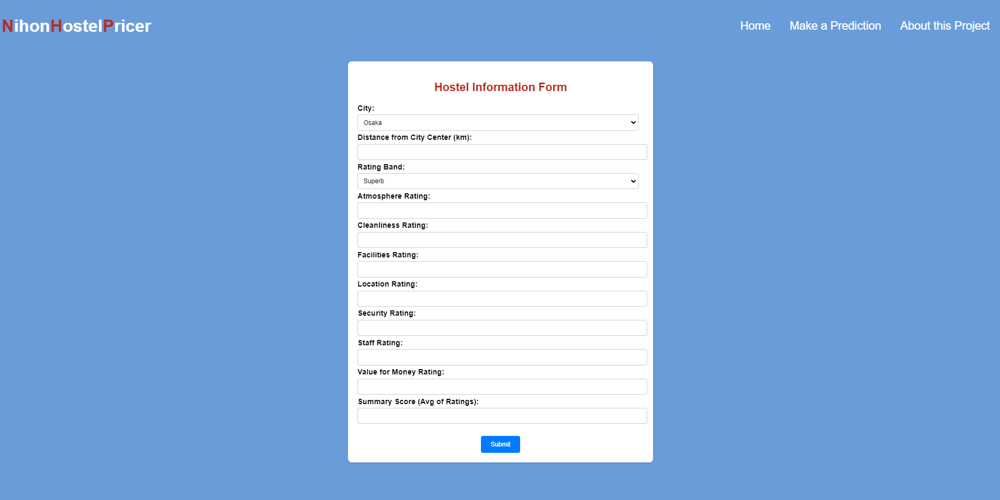
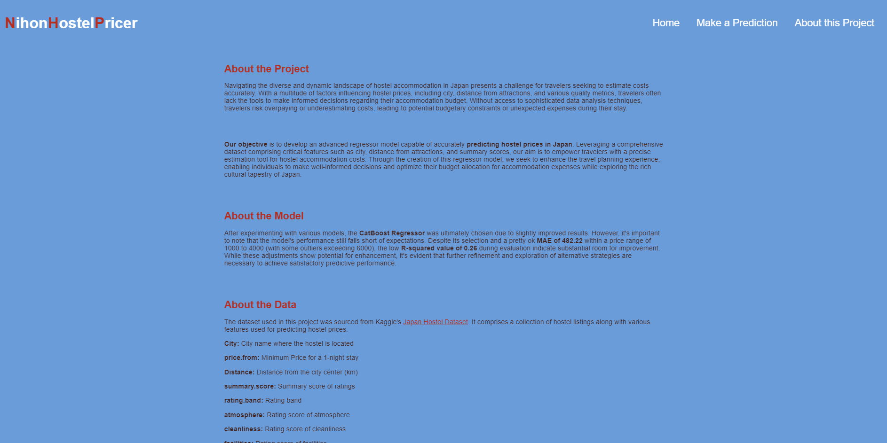

# Japan's Hostels Price Prediction

An end-to-end project utilizing catboost, Flask, Docker, and GitHub Actions for CI/CD deployment on Heroku.

---
## Contents

- [Project Overview](#project-overview)
- [Core Technologies](#core-technologies)
- [Get the Code and Set Up Locally](#get-the-code-and-set-up-locally)
- [Project Workflow](#project-workflow)
- [Web Application](#web-application)
- [Deploy and Run the Application with Docker](#deploy-and-run-the-application-with-docker)
- [AWS CI/CD Deployment with GitHub Actions](#aws-cicd-deployment-with-github-actions)
- [License](#license)
 
---
## Project Overview

This project aims to predict Japan's hostel prices per night based on their features using a catboost model. The workflow involves the following steps:

1. **Data Collection**: Data is obtained from Kaggle's [Hostel World Dataset](https://www.kaggle.com/datasets/koki25ando/hostel-world-dataset) using the Kaggle API. This dataset includes various hostel features such as ratings, Distance from city center, and summary score of the hostel.
2. **Data Preprocessing**: The collected data undergoes preprocessing to clean, transform, and prepare it for model training.
3. **Model Training**: Several models are validated, and the best one is chosen based on its Mean Absolute Error (MAE) score. The selected model is then fine-tuned and evaluated using the test data.
5. **Web Application**: A user-friendly web application is developed to allow users to input hostel features and receive real-time price predictions.

By combining data collection, preprocessing, model training, model evaluation, and web development techniques, this project offers a comprehensive solution for hostel price prediction that is easily accessible and usable by users.

To explore the detailed research and analysis conducted for the project, refer to the project's [Research Notebook](https://github.com/idalz/jpn-hostel-price-prediction/blob/main/research/00_idalz_research-notebook.ipynb).

---
## Core Technologies

- numpy
- pandas
- matplotlib
- seaborn
- scikit-learn
- catboost
- xgboost
- Flask
- gunicorn

---
## Get the Code and Set Up Locally

### Cloning the Repository and Setting Up Environment

To run the application on your local machine, follow these steps:

1. **Clone the Repository**:

Start by cloning the project repository from GitHub. Open your terminal and run the following command:

```bash
git clone https://github.com/idalz/jpn-hostel-price-prediction.git
```

2. **Set Up Kaggle API Key**

To access the dataset used in this project from Kaggle, you need to create a Kaggle API key. Follow the instructions [here](https://www.kaggle.com/docs/api) to create an API key.

3. **Create a Conda Environment**

Set up a Conda environment to isolate the project dependencies. Run the following commands in your terminal:

```bash
conda create -n <environment_name> python=3.8 -y
```

```bash 
conda activate <environment_name> 
```

\* Replace `<environment_name>` with the desired name for your Conda environment. 

4. **Install Requirements**

Install the project dependencies by executing the following command:

```bash
pip install -r requirements.txt
```

### Executing the Training Pipeline

To prepare the application for use, you'll need to execute the training pipeline. You can accomplish this by running the `main.py`: 

```bash
python main.py
```

By following this step, you'll prepare the application for use and ensure that the model is trained and ready for predictions.

### Running the Application

There are two options to run the application:

- **Using Python**

You can run the app using Python with the following command:
   
```bash
python app.py
```

- **Using Gunicorn (WSGI)**

Alternatively, you can run the app using Gunicorn with the following command:

```bash
gunicorn -w 4 -b 0.0.0.0:8080 app:app
```

Once the application is running, you can open your web browser and navigate to `localhost:8080` to access the application and try some predictions!

---
## Project Workflow

1. **Create component**
- Create a config dataclass.
- Create the compenent main class.

2. **Update the pipeline**
- Add the component to the pipeline.

---
## Web Application

The web application comprises three main pages:

#### Home Page

The home page serves as the primary interface for users and provides an overview of the application's functionality along with navigation options to access other pages.


*Figure 1: Home Page*

#### Form Page

The form page enables users to input various car features. Upon submission, the form triggers a POST request to the server to generate price predictions based on the provided features.


*Figure 2: Form Page*

#### About Page

The about page offers detailed information about the project, including its purpose, the trained model used for prediction, and a description of the dataset utilized for training the model.


*Figure 3: About Page*

These pages collectively provide users with an intuitive and interactive experience, facilitating easy exploration of the application's capabilities and insights into Japan's hostel price predictions.


---
## Deploy and Run the Application with Docker

1. **Download the Docker Image**:

Pull the Docker image from Docker Hub with the following command:
``` bash
docker pull idalz/jpn-hostel-price-prediction:latest
```

2. **Run a Docker Container**:

Launch a Docker container based on the downloaded image, specifying port mappings to expose port 8080:

```bash
docker run -p 8080:8080 -e PORT=8080 idalz/jpn-hostel-price-prediction:latest
```

Ensure the container is running by opening your browser and navigating to `localhost:8080`. You can now use the application to make predictions!

---
## Heroku CI/CD Deployment with GitHub Actions

### 1. Login to Heroku Dashboard

### 2. Create New App

1. **App name**: Assign a name.
2. **Choose a region**: Select a region.

### 3. Add the Deployment Method

1. Choose github.
2. Confirm the repository name.

### 5. Setup GitHub Secrets

Navigate to your GitHub repository settings -> Secrets and variables -> Actions.
Add your repository secrets:

- HEROKU_API_KEY
- HEROKU_EMAIL
- HEROKU_APP_NAME

Now, whenever you push changes to your GitHub repository, GitHub Actions will trigger a workflow that handles those changes and deploys them to Heroku.

---
## License

This project is licensed under the [MIT License](LICENSE).
